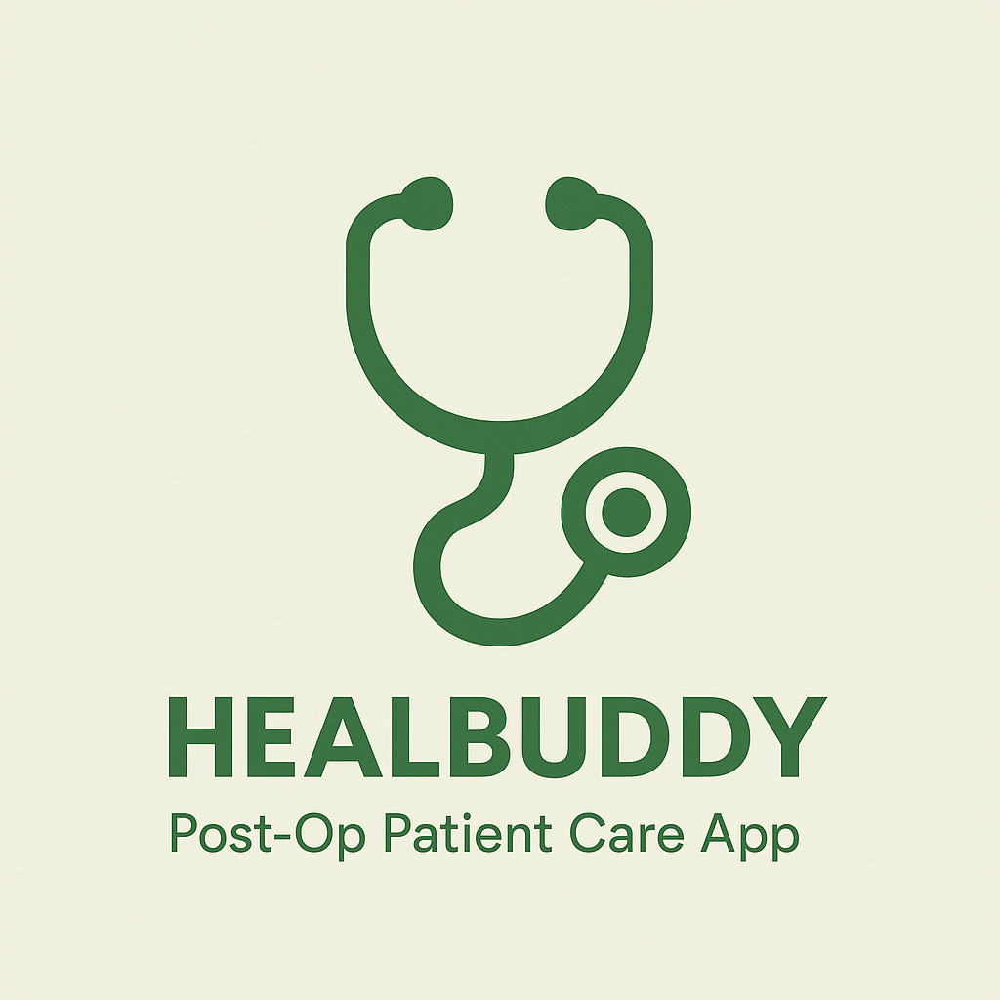

# 🧠 HealBuddy – Your Post-Surgery Recovery Companion

**HealBuddy** is a multi-agent AI web app designed to support patients during post-surgical recovery. It combines empathetic UI with smart assistants powered by **Gemini** and **GPT-4**, providing personalized guidance, symptom checking, and calming support — all from a browser.



---

## 🚀 Features

- 🤖 **Multi-Agent AI System**  
  - **Gemini**: Symptom checker  
  - **GPT-4**: Mind Ease

- 🐱 **Calm Companion Mode**  
  Interactive cat that purrs, smiles, and reacts when clicked or fed — helping patients feel calm and comforted.

- 🧠 **Context-Aware Responses**  
  All agents use a patient profile to personalize replies (e.g. 7 days post-surgery), limiting hallucination and improving clarity.

- 🗂️ **MongoDB Patient Profile**  
  A simple profile form stores basic recovery context in MongoDB and injects it into LLM prompts.

---

## 🏗️ Project Structure

```
ProjectHealBuddy/
├── Backend/                ← Flask app with GPT & Gemini agents
├── mindease.html           ← Emotional support chat UI
├── symptoms.html           ← Symptom checker UI
├── home.html               ← Landing page with patient form
├── chatbots.html           ← All-in-one chat view
├── cat/                    ← Calm Companion (interactive cat)
├── *.css / *.js            ← Page-specific styles and logic
└── *.png / *.gif / *.wav   ← Visual and audio assets
```

---

## 💬 Sample Use Cases

> 🧠 **“I feel itchy after surgery. Is that normal?”**  
> ✅ Symptom Checker (Gemini) replies with 3–5 supportive suggestions.

> 💪 **“I'm frustrated with my healing.”**  
> ✅ GPT Coach responds with encouraging bullet points.

> 🧘 **“What should I focus on today?”**  
> ✅ Recovery tips and motivation in a friendly tone.

> 🐾 **Tap the cat** → it purrs and smiles  
> ✅ Instant calm and comfort.

---

## 🛠️ Tech Stack

- **Frontend**: HTML, CSS, JavaScript  
- **Backend**: Python (Flask), OpenAI GPT-4, Google Gemini Pro  
- **Database**: MongoDB Atlas  
- **Deployment**: Render (backend), GoDaddy (frontend)

---

## 👥 Team HealBuddy

- **Pavan** – AI Agents and Ops  
- **Harshitha** – UI & UX  
- **Nithin** – Backend, Integration

---

## 🏁 Judges, Try This:

- Ask symptoms ➡️ Get personalized response  
- Visit the Cat Companion for fun distraction  
- Experience the emotional support tone ➡️ MindEase

---

## 🔮 Future Improvements

- 📚 **RAG (Retrieval-Augmented Generation)**  
  Integrate a knowledge base of post-operative care PDFs and discharge summaries using vector embeddings and RAG. This will allow agents to provide context-rich, evidence-based responses tailored to specific procedures.

- 🎯 **Smart Profile Matching**  
  Personalize agent behavior based on surgery type, day of recovery, and patient preferences — using patient metadata in MongoDB.

- 🔍 **Conversation History**  
  Add lightweight session memory or persistent logs to support multi-turn interactions and context continuity.

- 🌐 **Voice Support**  
  Allow patients to interact with agents in thorugh using  Web Speech APIs.

- 📈 **Progress Insights**  
  Generate positive feedback using patient trends (e.g., “You’ve stayed consistent for 3 days!”).

---

🔗 Designed with empathy. Built for comfort. Demoed with love.  
**#HackathonReady 🧠💬🐾**
